# Figuring out how to set up ESLint and Prettier

3 min read · June 3, 2023

## Difference between ESLint and Prettier

As this got me confused for a while I think I finally got the gist of how these two differe and complement each other.

### ESLint

ESLint is an open source project which statically analyzes your code to quickly find problems based on a set of rules which can be tailored to your liking in its config file. Its goal is to make your code more consistent and avoid bugs. It is built into most text editors and you can run ESLint as part of your integration pipeline. ESLint can also automatically fix many problems that you encounter and alter your code where possible.

ESLint is completely pluggable. Every single rule is a plugin and you can add more at runtime. You can also add community plugins, configurations, and parsers to extend the functionality of ESLint.

Fun fact: As I am German I learned that a linter is actually that thing here

It makes sense if you think about it, if you lint something all the fuzz (bugs, bad code practices) you don't want on your freshly steamed shirt (codebase) will stick to the linter (ESLint underlining no-nos or fixing them for you).

### Prettier

Prettier is an opinionated code formatter with support for a bunch of different languages and frameworks like CSS, JSX, Typescript, etc. Prettier enforces a consistent code style (i.e. code formatting that won't affect the AST) across the entire codebase. It basically disgards the original styling by parsing it away and re-painting the parsed AST with its own rules that take the maximum line length into account, wrapping code when necessary.

```js
//Instead of this

foo(
  reallyLongArg(),
  omgSoManyParameters(),
  IShouldRefactorThis(),
  isThereSeriouslyAnotherOne()
);

//Prettier does this

foo(
  reallyLongArg(),
  omgSoManyParameters(),
  IShouldRefactorThis(),
  isThereSeriouslyAnotherOne()
);
```

## How ESLint works under the hood

## Setting up ESLint

First I run make sure that I have my package.json file present in the directory and then I run `npm init @eslint/config@latest`. It will prompt me with a few questions to set up the config file for me

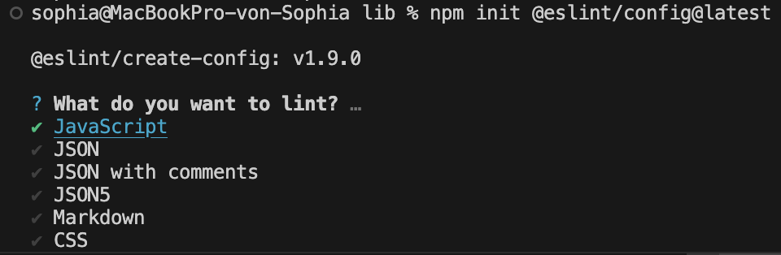
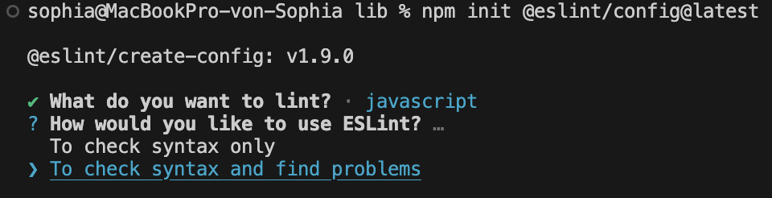
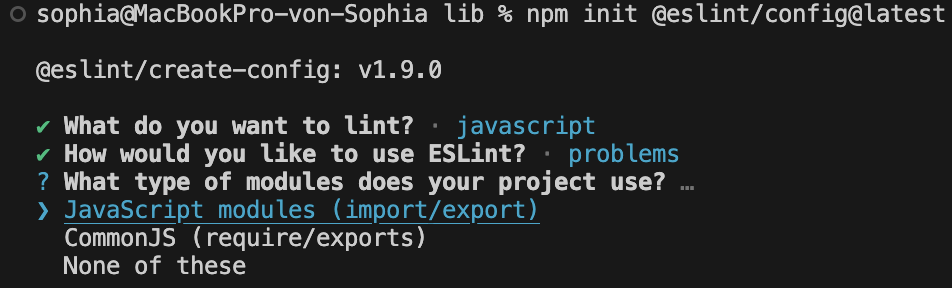
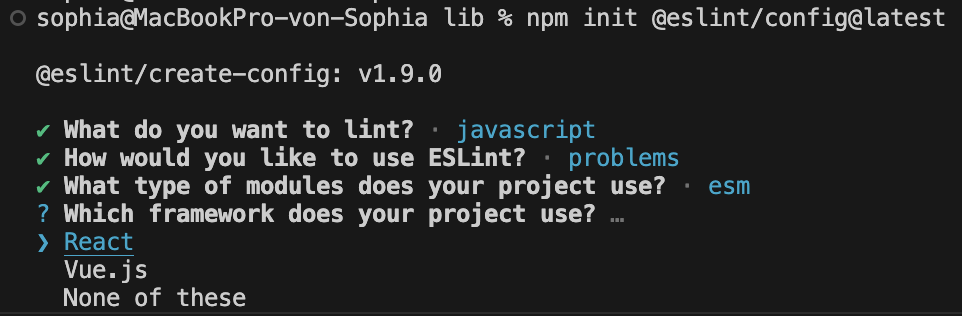
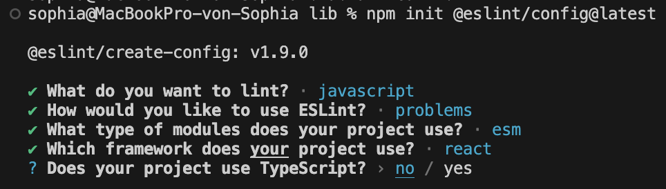
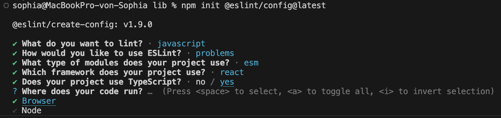
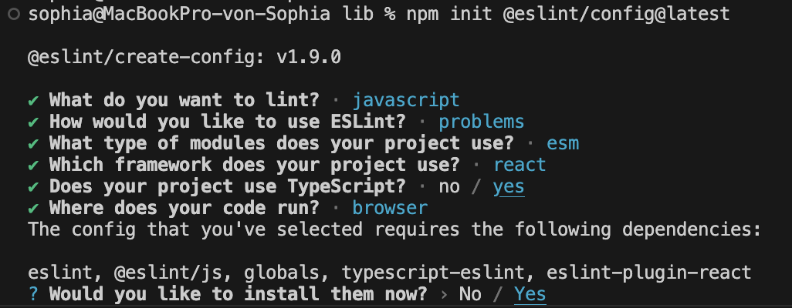
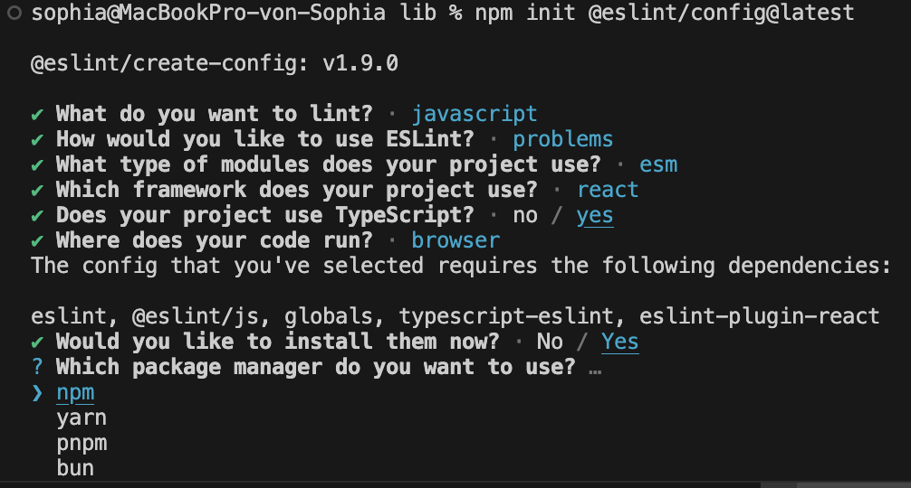

The dialog helps to identify which packages I need to get up and running with ESLint for my needs and it does the installation and configuration of the config file which looks like this

```js
import js from "@eslint/js";
import globals from "globals";
import tseslint from "typescript-eslint";
import pluginReact from "eslint-plugin-react";
import { defineConfig } from "eslint/config";

export default defineConfig([
  {
    files: ["**/*.{js,mjs,cjs,ts,mts,cts,jsx,tsx}"],
    plugins: { js },
    extends: ["js/recommended"],
  },
  {
    files: ["**/*.{js,mjs,cjs,ts,mts,cts,jsx,tsx}"],
    languageOptions: { globals: globals.browser },
  },
  tseslint.configs.recommended,
  pluginReact.configs.flat.recommended,
]);
```

Let's go through each line one by one and explain what it does.

---

Let's first look at the import statements:

```js
import js from "@eslint/js";
import globals from "globals";
import tseslint from "typescript-eslint";
import pluginReact from "eslint-plugin-react";
```

Each one of these imports brings in a plugin or configuration preset to extend ESLint's capabilities.

```js
import js from "@eslint/js";
```

This imports the base ESLint config for JavaScript.

- It includes rules from ESLint's core for standard JavaScript syntax (ES2021+)
- It exposes presets like js.configs.recommended, which I can spread into my config

```js
import globals from "globals";
```

This imports a list of known global variables for different environments (like `window`, `process`, etc.). I use it to tell ESLint: "These globals exist - don't warn me about them being undefined.". This way I avoid false positives when ESLint sees things like `window` or `process` and thinks they're undefined.

```js
import tseslint from "typescript-eslint";
```

This brings in the TypeScript ESLint plugin + parser, which allows ESLint to understand `.ts` and `.tsx` files. This is required if you're linting TypeScript code, as ESLint doesn't understand TS out of the box.

```js
import pluginReact from "eslint-plugin-react";
```

This imports the popular React ESLint plugin, which provides rules specific to React components and JSX. It helps me catch bugs in JSX/React code and enforce style conventions like using key in lists.

---

```js
import { defineConfig } from "eslint/config";
```

The defineConfig function explicitly signals to ESLint and the code editor that this file is an ESLint configuration file. This function is typed, meaning it has TypeScript types bundled with it. When I write:

```js
export default defineConfig({
  rules: {
    "no-unused-vars": "warn",
  },
});
```

IntelliSense knows

- what properties (`rules`, `extends`, `parserOptions`, etc.) are valid,
- what values are allowed (`"off"`, `"warn"`, `"error"`),
- what plugins or environments can be used,
- and can catch typos or invalid keys.

Without `defineConfig`, I might write:

```js
export default {
  ruls: {
    /* typo here */
  },
};
```

And IntelliSense may not catch it, because it's just a plain object. The code editor doesn't know how to validate its structure unless you explicitly wrap it in a function with types, like `defineConfig`. It gives you smart autocompletion and catches mistakes before ESLint even runs to validate the config file.

For this to work it requires the TypeScript Language Server to be present in your IDE. [This post](...) goes into depth on how the TypeScript Language Server works.

---

Next let's look at the actual config object:

```js
export default defineConfig([
  {
    files: ["**/*.{js,mjs,cjs,ts,mts,cts,jsx,tsx}"],
    plugins: { js },
    extends: ["js/recommended"],
  },
  {
    files: ["**/*.{js,mjs,cjs,ts,mts,cts,jsx,tsx}"],
    languageOptions: { globals: globals.browser },
  },
  tseslint.configs.recommended,
  pluginReact.configs.flat.recommended,
]);
```

The actualy config object confused me a lot. It appears that ESLint enforces a new structure which is called a flat config. This is just an array of config objects passed to defineConfig(). Each object can:

- apply only to certain files (`files`)
- define environments or language options (`languageOptions`)
- use plugins and rules (`plugins`, `rules`)
- extend other configs (`extends`)

It works kind of like layered overrides: later configs can build on or override earlier ones.

```js
{
  files: ["**/*.{js,mjs,cjs,ts,mts,cts,jsx,tsx}"],
  plugins: { js },
  extends: ["js/recommended"],
},
```

This applies ESLint's built-in JS rules (via `@eslint/js`) to most JS and TS files. ESLint sees `"js/recommended"` because I imported `js` from `@eslint/js`, and that's how it exposes its rules. I register it like a plugin with `plugins: { js }`.

---

```js
{
  files: ["**/*.{js,mjs,cjs,ts,mts,cts,jsx,tsx}"],
  languageOptions: { globals: globals.browser },
},
```

This adds global variables from the `globals.browser` list (like `window`, `document`) for the same set of files. This way ESLint doesn't yell at me for using browser globals as explained earlier.

---

```js
{
  tseslint.configs.recommended,
},
```

This is a prebuilt config object from `typescript-eslint`. It contains parser config, language settings, plugin setup, and a bunch of recommended rules. No `files` here - it applies globally unless scoped in other ways.

---

```js
{
  pluginReact.configs.flat.recommended,
},
```

Does the same as above - this is a prebuilt config object from the React plugin, using the new `flat` format. It enables JSX parsing and recommended React rules.

---

Some things I asked myself:

Why do I define the plugin and then use extends? Doesn't the plugin already add all the recommended rules?

- `plugin: { js }` makes the plugin available to ESLint
- `extends: ["js/recommended"]` actually enables its rules

Why isn't just `extends` enough?

- ESLint needs to know where `"js/recommended"` comes from - and that's what the `plugins: { js }` part does.
- Because flat config is explicit and modular. I'm registering a namespace, and then referencing it. ESLint no longer “magically” looks up packages by string name like in the old extends: ["eslint:recommended"] style. It’s more like ES modules: I import the plugin, give it a name (`js`), and then use that name.

Why doesn't this apply to `tseslint` and `pluginReact`?

- These are already full config objects, not just rules. So I don't need to define it via `plugins` or `extends` - it already includes:
  - `plugins: { "@typescript-eslint": ... }`
  - `parser: tseslint.parser`
  - `rules: { ... }`

Why doesn't js work like tseslint and requires this extra setup?

- `@eslint/js` is just a collection of rule presets (like `"js/recommended"`), not full ESLint config objects like `tseslint`. I should think of it as a library of rules, not a full ESLint config.

Why not make `@eslint/js` like `tseslint`?

- `@eslint/js` is ESLint's official way to export the core rules as a plugin, but it's intentionally lightweight and modular, leaving composition up to the user
- `typescript-eslint` is a 3rd-party plugin that chose to wrap everything in a ready-to-use preset, knowing users often want a "just works" config

## How to debug ESLint

So now that I know what the initial config setup does I wondered how I can debug ESLint's rules if I were to add new config blocks and plugins myself?

### ESLint VSC extension

A great tool is the ESLint extension in VSCode which I had already installed earlier and enabled me to get the colorful squiggly lines to hint errors and warnings from ESLint. So instead of manually running the ESLint command for every file it will analyze the code on file changes.

### Adjusting React rule

The first error I ran into was this one:

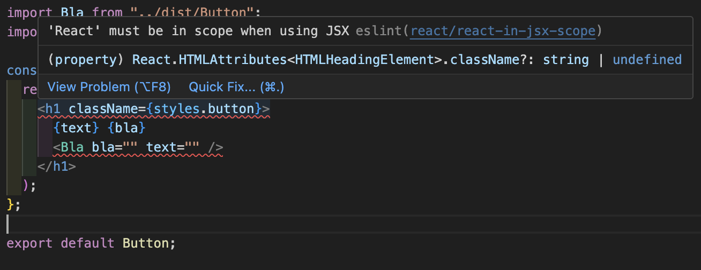

I followed the url to the error explaining that it will check for missing React imports, but in React +17 versions React is set as a global variable thus not requiring React to be imported in every single file. According to the [npm site of the eslint-plugin-react package](https://www.npmjs.com/package/eslint-plugin-react) I can disable this rule by adding `pluginReact.configs.flat["jsx-runtime"],` to the `defineConfig` function:

```js
{
  pluginReact.configs.flat["jsx-runtime"],
},
```

Once I saved the config file the error disappeared and if I run `npx eslint src/Button.tsx` no error was shown.

### Trying out rules

I added an unused variable to my component file and ran the linter with `npx eslint src/Button.tsx`. It showed me the following error:

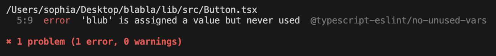

I wanted it to treat it as a warning instead of an error. At first I thought it was a rule defined by the JavaScript plugin but in the console it said `@typescript-eslint/no-unused-vars`. This meant that I had to add another config block after the TypeScript plugin config block to overwrite that rules:

```js
{
  ...
  tseslint.configs.recommended,
  {
    files: ["**/*.{js,mjs,cjs,ts,mts,cts,jsx,tsx}"],
    rules: {
      "@typescript-eslint/no-unused-vars": "warn",
    },
  },
}
```

On the next ESLint run it worked as expected:

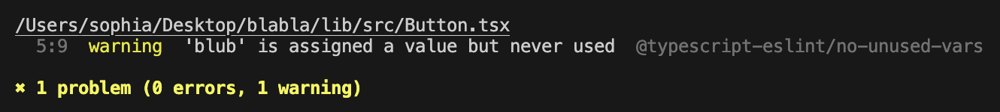

### Adding a Markdown plugin

From the ESLint Docs I saw that there's a `@eslint/markdown` plugin which let's me lint JavaScript code inside if Markdown code blocks. So I wanted to give it a try and see if I could make it work.

I installed the package with `npm i -D `

I then added the import statement and the config block to the defineConfig function:

```js
import markdown from "eslint-plugin-markdown";

{
  ...
  markdown.configs.recommended,
  ...
}
```

I then created a `test.md` and added a code block only to see that it worked right out of the box:

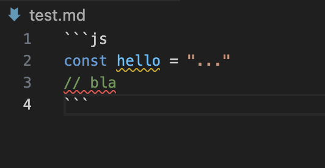

### Adding a shareable configuration

The ESLint Docs mentioned the `eslint-config-airbnb-base` package as a popular JavaScript style guide.

I enjoyed reading the analogy of the [official AirBnB Style Guide](https://airbnb.tech/opensource/javascript-style-guide/).

After a bit of research I couldn't discover a working and straight-forward solution to making the `eslint-config-airbnb-base` package work with ESLint v9, as the package is not compatible with the new flat version of ESLint config files. I had hoped that [this Medium article](https://medium.com/@1608naman/a-flat-attempt-at-the-eslint-flat-config-393005212d67) by Naman Dhingra would help me solve the migration. So I decided to abandone it for now as I run only into more errors which I can't seem to resolve myself with my current limited knowledge.

### ESLint rules overlapping with TypeScript Language Server

I had a default TypeScript config set up with rules that enforced linting inside the `compilerOptions` object. VS Code has built-in support for TypeScript via the TypeScript Language Server (TS Server). It runs automatically in the background when I open .ts or .tsx files, and it uses my tsconfig.json to

- parse my project
- provide IntelliSense
- show type errors and warnings
- enforce some stylistic or semantic rules, e.g. unused variables, unreachable code, etc.

When hovering over the warning in the code VS Code will show `TS6133: 'x' is declared but its value is never read.` (-> That's Typescript, not ESLint) or `eslint(no-unused-vars): 'x' is defined but never used.`(-> That's from ESLint).

In my case the eslint warning wasn't even showing up, so I had to restart the eslint server with `cmd+shit+P` and searching for `ESLint: Restarting ESLint Server` which did the trick.

Next I wanted to see if I could disable the TS warnings. I saw that the tsconfig.json had this defined `"noUnusedLocals": true,`. So I commented it out and restarted the TS Language Server just in case. But the warning remained. So I figured that the TS Language Server had some default rules automatically enabled and I had to explicitly turn it off in the `tsconfig.js`. This unfortunately didn't solve it either so I am left clueless on how to possibly fix this.

### Fixing ESLint warnings/errors on file save

I set up the same error as before, where I would have an unused variable with double-quotes and no semicolon at the end.

I was testing a lot to get the ESLint fix on save working by tweaking my settings.json in VS Code, checking my eslint config file, etc. Then I was wondering if theres anything to fix in the first place in the file, so I ran `npx eslint .src/Button.tsx --debug --fix` which gave me a huge colorful output and even said that it applied the fixes, but nothing changed in the file.

After watching [this video](https://www.youtube.com/watch?v=IRdPRIPd9FM&t=238s) by The Common Coder I figured that I had no rule set that was actually fixable by ESLint, so instead I added the rule to enforce comments with a capital letter:

```js
"capitalized-comments"[("error", "always")];
```

Turns out the ESLint CLI fixed it as well as saving the file. So my configurations are working.

I also figured out that there was the `@stylistic/eslint-plugin` package that takes care of stuff like adding missing semicolons or indentation. So basically the stuff that Prettier does for me.

## How Prettier works under the hood

## Setting up Prettier

## Resolving ESLint and Prettier conflicts

As seen in [this video](https://www.youtube.com/watch?v=IRdPRIPd9FM&t=238s) by The Common Coder I could just add a package to add Prettier rules to the ESLint config and enforce formatting through that. The [Prettier Docs](https://prettier.io/docs/integrating-with-linters) discourage from doing so for a couple of reasons:

- You end up with a lot of red squiggly lines in your editor, which gets annoying. Prettier is supposed to make you forget about formatting – and not be in your face about it!
- They are slower than running Prettier directly.
- They’re yet one layer of indirection where things may break.

There's also [this rant](https://www.youtube.com/watch?v=Cd-gBxzcsdA) by Theo who points out the difference between ESLint and Prettier and why to separate Formatting and Linting instead of having ESLint do both.

So instead I added the "eslint-config-prettier" package to disable conflicting prettier rules in ESLint config and leave my Prettier config file as is. I also set prettier to be my default formatter on file save in settings.json

## Takeaways

- ESLint and Prettier are powerful tools which require a bit of configuration to get everything up and running
- Carefully reading the tooling Docs and console log can already hint a potential problems when setting everything up

## Sources

- [ESLint Docs](https://eslint.org/docs/latest/use/getting-started)
- [Prettier Docs](https://prettier.io/docs/)
- [DigitalOcean Article](https://www.digitalocean.com/community/tutorials/linting-and-formatting-with-eslint-in-vs-code)
- [A Rant on Formatters and Linters](https://www.youtube.com/watch?v=Cd-gBxzcsdA) by Theo
- My good buddy ChatGPT
