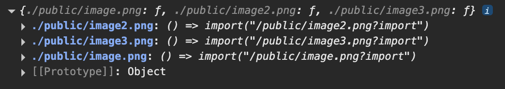

# I took the Vite FrontendMasters course by Steve Kinney and here are my takeaways

Thanks to the GitHub Educational Student Pack I was able to claim a free 6 months trial for FrontendMasters.

- [How to set up Vite](#how-to-set-up-vite)
- [How Vite bundles (a-)synchronous JavaScript modules](#how-vite-bundles-a-synchronous-javascript-modules)
- [How Vite bundles stylesheets (modules)]()
- [How to configure PostCSS that comes with Vite]()
- [How to use SCSS/Sass with Vite]()
- [How to use Typescript with Vite]()
- [How to use Vite templates to easily set up a project]()
- [How to configure the Vite config file](#how-to-configure-the-vite-config-file)
- [How to bundle static assets](#how-to-bundle-static-assets)
- []()
- []()
- []()
- []()
- []()

## How to set up Vite

Vite is a build tool which says to be lightning fast and uses Rollup as its actual build tool under the hood pre-configured with sensible defaults and powerful plugins. Vite also provides a fast development server as well as a plugin system for enhancing Rollup's functionality and through that enabling support for frameworks such as React.

We don't even need to create a vite.config.js file as everything works out of the box and is only needed if we want to add Plugins and adjust the tooling used under the hood.

## How Vite bundles (a-)synchronous JavaScript modules

The entire bundling process depends on what is contained in your index.html as this is the entrypoint for Vite to start the bundling process.

If Vite spots a change in your code it will rebuild the respective file. The assets folder in the dist folder contains the js and css bundled files. They will receive a unique hash suffix every time they are rebuild, so that the unchanged files can be pulled from the browser's cache.

## How Vite bundles stylesheets (modules)

Vite uses PostCSS which works out of the box to give us the css modularization to prevent classname collisions.

As soon as we turn a normal css file into a module.css file Vite will automatically equipt every class with a unique suffix to isolate each class and thus prevent collisions. As this is dynamic the classnames need to be assigned dynamically as well instead of statically in the html code.
By adding 'module.css' Vite will offer a default export of that style module which we can use as an object to assign our classes in our JS code. Module styles are only bundled if they are imported into a component and code split and only loaded if the js module is loaded in which you import them. So even if you import the styles, if you don't use them anywhere they won't be included in the bundle.

## How to configure PostCSS that comes with Vite

Vite has its own config files for all the tools it uses under the hood. We only want to create a config file if we want to overwrite these default configurations to be considered by Vite.

## How to use SCSS/Sass with Vite

Vite has Sass already configured and only requires the actual Sass package which we need to install via npm and then it everything works seamlessly.

## How to use Typescript with Vite

As with the other tools Typescript is also already configured and will transpile our Typescript code into valid Javascript code. Apart from that we only need to add the types to our code. And even if our ts code is riddled with mistakes that makes the Typescript compiler furious Vite would still compile it without any issues. So it is best to run the Typescript compiler in a separate step first to check for any type errors and then run the Vite build process.

## How to use Vite templates to easily set up a project

npm create vite@latest

If you don't give it any parameters it will prompt you with different options to configure your new project, such as the framework or the if you want Typescript.

When using any preprocessors such as SCSS or Sass we need to make sure that we have the dependency installed, for instance `npm install -D sass-embedded`.

When trying to import a scss module to one of my files I saw that TS was getting angry at me, because it couldn't find that module. [This article](https://medium.com/@pedro_sfg/fixing-ts2307-cannot-find-module-module-scss-in-typescript-react-projects-679dc7b34103) by pedro_sfg helped me to define a declaration file so that it stops showing me these red squiggly lines under my import statements. I watched [this video](https://www.youtube.com/watch?v=s_CZeWuEZ_s) by Maksim Ivanov to help me clear up what these d.ts files actually do.

## How to configure the Vite config file

Exporting an object is already resulting in a valid config file structure. We can use

```
import { defineConfig from 'vite' }
```

to have our IDE tell us if we misspelled something or want to have autocompletion, which is overall very handy

```
export default defineConfig({
  // define config here
})
```

## How to bundle static assets

Static assets are anything other than html, js and css, for instance images and fonts.

It basically lifts and shifts the assets from the public folder to the dist folder and adds a hash to the file names.

If an image is small enough Vite won't add it to the bundle and instead adds it to the bundled code by converting it to a base64 encoded image and inlining it in the code. This is where the Vite preview comes in handy as you can check for the source of that asset inside the Browser Dev Tools. It didn't work in my case even though I used a 4kB icon. It simply added it to the dist folder but didn't show it specifically in the command line as being exported to it.

This feature is handy as it saves an http request by converting small assets to inline code.

Steve also introduced a Vite plugin called imagetools which gives us the ability to add parameters to the image import path and convert it on the spot which impacts the final bundle.

## How to use environment variables

Vite will naturally only consider those env variables which are prefixed with VITE, for instance VITE_BASE_URL="...". These can be defined in a .env file and used inside the vite.config.js to configure everything where needed, for instance if different variables are required for development, testing or production.

When using import.meta.env to list all of our env variables typescript is not happy about it as this is not a web standard but a Vite specific thing, so TS doesn't know how to handle it. Fortunately, the Vite package brings its own types which we can simply use to have TS understand what this object actually is and not be mad at us anymore for leaving it in the dark. We can accomplish this by creating a vite.d.ts file and add

```
/// <reference types="vite/client" />
```

## How to import only necessary data from JSON and thus reduce bundle size

When importing the JSON file data we can destructure the object and only get that specific section of the object.

## How to use glob to dynamically add files to the bundle

We can use the import.meta.glob function which is specific to Vite to render files dynamically at build time to add them to the bundle. So with glob it will take a path and go through all specified files to find a matching name and return a promise with an object containing all the file import statements. For instance if we have a ton of images that we want to add on a page and instead of manually writing all the import statements and managing them in case there are adjustments to be made, we can simply use the glob function which looks into the image folder and does the importing on the fly at build time for us.

```
console.log(import.meta.glob('./logos/**/*.svg')); //this will return the entire glob object
```




To traverse through all the entries of this object we can write the following:

```
for (const [path, module] of Object.entries(import.meta.glob('./public/**/*.png))) {
  console.log(path, module); //this will return the path and module key from each entry of the glob object which contains information on each matched file
}
```


Next up we can use this dynamic info and add it to the DOM with a bit of JavaScript by running a for of loop to iterate through each glob object entry

```
const content = document.querySelector('#content');

for (const [path, module] of Object.entries(
  import.meta.glob('./public/**/*.png)
)) {
  module().then((url) => {
    const img = document. createElement('img');
    img.src = url.default;
    img.height = 200;
    content.appendChild(img);
  })
}
```

As the second key returns a function which returns a promise we can invoke it and use then to receive the data of that module which returns a default export, containing the url pointing to that module which is our image.

And we could also go ahead and have glob resolve all of the promises for us, so we don't have to manage it ourselves with the then function.

```
for (const [path, module] of Object.entries(
  import.meta.glob("./public/**/*.png", { eager: true })
)) {
  console.log(path, module);
}
```


## How to use Library Mode

So far the entrypoint for Vite was index.html. But when we want to build and ship a library we usually don't have an index.html file. Imagine we create a react component library with the vite react template and this is our folder structure

```
src
|
| /components
|--button.module.scss
|--button.tsx
|--input.module.scss
|--input.tsx
|--index.ts

```

> We need to make sure that the exports are explicit and not defaults as Vite won't be able to pick up on that, thus resulting in an empty bundle.
> So the Vite config helps us tweak our build in a few ways.

```
 export default defineConfig({
  plugins: [react()],
  build: {
    // this is our helpful new config object
  }
 })
```

The build object takes another object for the lib key and defines the new entrypoint where Vite should start building the bundle. So instead of index.html which is the default we want to say that it should read the index.\* inside the components folder.

```
import react from "@vitejs/plugin-react";
import { resolve } from "path";
import { defineConfig } from "vite";

// https://vite.dev/config/
export default defineConfig({
  plugins: [react()],
  build: {
    lib: {
      entry: resolve(__dirname, "src/components"), //we can use __dirname to get the current directory in which this file is located in
      name: "fancy-react-lib", //we can give our library a name
      fileName: "frl", //this is the output filename in the dist folder when we run our build process
    },
  },
});
```

If we now build our library it will also add the entire React library which doesn't just unnecessarily bloat our bundle but it is also save to say that our users potentially don't need another version of React in their application.


We can adjust this in the rollupOptions object, so that we can tell Rollup (the bundler Vite uses under the hood) what to look out for when bundling our library.

```
export default defineConfig({
  plugins: [react()],
  build: {
    lib: {
      entry: resolve(__dirname, "src/components"),
      name: "fancy-react-lib",
      fileName: "frl",
    },
    rollupOptions: {
      external: ["react", "react/jsx-runtime"],
      output: {
        globals: {
          react: "react",
          "react/jsx-runtime": "jsxRuntime",
        },
      },
    },
  },
});
```

The external array defines the names of every package you don't want to include in the bundle, whereas the output object couples them to the respective import name, so we're basically telling Vite to assume that there's a React and ReactDOM object already existing and provided by the consumer;


## How to generate declaration files

We can use another plugin called vite-plugin-dts that generates all the declaration files for us on the fly and adds it to our bundle, so that our users can use them in their application to infer the types with TypeScript.

```
npm install -D vite-plugin-dts
```

We then need to add it to our plugins and run our build script.

```
...
import dts from "vite-plugin-dts";

// https://vite.dev/config/
export default defineConfig({
  plugins: [react(), dts({ tsconfigPath: "./tsconfig.app.json" })],
  ...
});

```

For Steve it worked without adding any parameters to the dts function, but in my case it didn't do anything when running the build script. The plugin's docs say that one should add the path to the tsconfigPath if using a Vite template and this did the trick.


## How to add the index.css from the bundle to every js file

If a user wants to use one of the components from the library. If they were to do it right now the styling wouldn't be applied as Vite bundles the styles into their own file but doesn't import it into the js bundle which means that if a user is importing the js module they won't automatically import the styles as well, as there is no import statement inside the js module to define that step.

We can resolve this by adding another Vite plugin called `vite-plugin-lib-inject-css`, which automatically adds the import statement at the top of every js module on build.

## How to make the library actually usable

Next up we need to adjust the package.json a bit so that we define all the information the IDE needs when installing our package.

```
{
  "name": "lib",
  "private": true,
  "version": "0.0.0",
  "type": "module",
  "main": "./dist/frl.umd.cjs",
  "module": "./dist/frl.js",
  "exports": {
    ".": {
      "import": "./dist/frl.js",
      "require": "./dist/frl.umd.cjs",
      "types": "./dist/index.d.ts"
    }
  },
  ...
}
```

`main` specifies the entrypoint for CommonJS (CJS) environments and is used by Node.js when using require() and is considered older tooling. As it is still used here and there we define this for backward compatibility.
`module` indicates the ES Module (ESM) entry point for bundlers (like Rollup, Webpack) and is used by tools that support ESM tree-shaking, like modern build tools. So this is mainly for optimization (tree-shaking) and is not a Node.js standard - it's a convention used by bundlers.
`exports` provides a modern, explicit mapping of how our package should be imported and is used by Node.js, bundlers and TypeScript. It will override `main` and `module` if used in the code. This ensures consumers get the right file depending on how they’re importing:

import lib from 'lib' → gets ESM file

const lib = require('lib') → gets CommonJS file

TypeScript gets index.d.ts as the type definition

I wondered if `main` and `module` is needed if `exports` basically does the same, and technically it can replace both of them fully, but they both are needed for backward compatibility as not every tool actually supports the `exports` field.

Here's an overview of when which field is being used:


## How to actually use the library in another project

### npm link

Steve simply used npm link to create a simlink between the library folder and the app folder to import the components from it, which I am not the biggest fan of as it feels a bit unnatural opposed to running the classic `npm install` command.

We navigate into the app folder and run `npm link` with the path to the library folder. This creates a simlink inside the node_modules folder so that we reference the actual raw components inside our lib folder.

```
npm link ../lib
```

If we then try to import and use the components like we would do with any other package we will see that it works out of the box just as expected.

### yalc

Yalc is a node package which provides us with a local registry where we can publish our packages to instead of using simlinks or publishing them to the npm registry. This way we can actually install, update and remove them from our repositories as we would do with npm.

First I installed yalc globally

```
npm i -g yalc
```

Then I configured my package.json to only include the files from the dist folder by defining the following:

```
{
  ...
  "files": {
    "dist"
  }
  ...
}
```

This will import all the files inside the dist folder alongside LICENSE, README.md and package.json.

Then added the package to the tiny local registry that yalc provides us. `--public` will let me publish the package to the local registry despite my package being marked as private in the package.json. `--files` shows you all the files it actually adds.

```
cd lib
yalc publish --private --files
```


I can now cd into my app folder and install it like any other project by using yalc instead of npm

```
yalc add lib
```

This will create a .yalc folder in which it stores the package files from the registry. It will also add a simlink to the node_modules folder much like `npm link`. Finally it creates a yalc.lock to maintain the correct versions of each package.

I can now import my Button and Input components from `lib` and see them being properly displayed when running the dev server.

##

## Conclusion

Besides the frequent weird singing that Steve Kinney habitually does it was a super straight-forward course that breaks down Vite into bite-sized learnings.

It was missing a more prompts with actual hands-on assignments, but instead I just went ahead and tried to apply every lesson myself to a small Vite project and checked if I receive the same results as showcased in this post.
